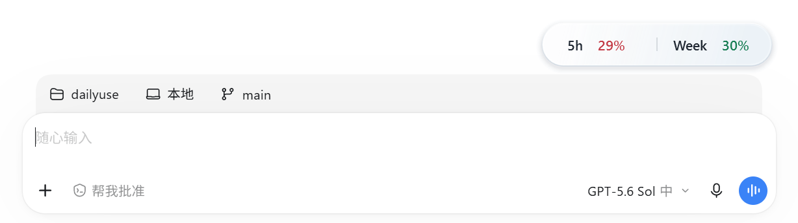
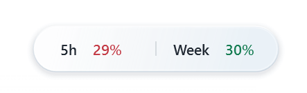
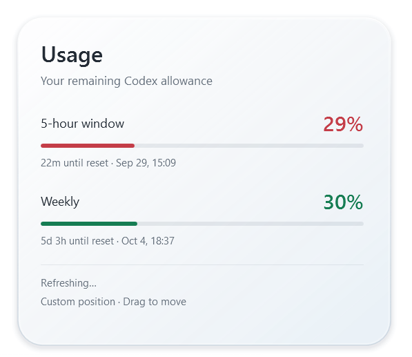

# Codex Monitor

一款轻量的 Codex 桌面端额度悬浮监视器，以白色玻璃胶囊显示 5 小时和每周剩余额度，并可展开查看重置时间。

> [!IMPORTANT]
> **仅支持 Windows。** 需要 Windows 10/11、已登录的 Codex 桌面客户端，以及 .NET Framework 4.8。



## 界面预览

| 胶囊视图 | 详情面板 |
| --- | --- |
|  |  |

## 功能特点

- 胶囊及详情面板使用英文界面，数字显示真实剩余额度。
- 胶囊左右等宽、分隔线居中；剩余额度低于 30% 显示红色，30% 及以上显示绿色，应用于胶囊百分比、面板百分比及进度条。缺失数据保持灰色。
- 胶囊标签与百分比统一为 14px、SemiBold 字重。
- 默认对齐输入框右边缘，跟随窗口移动与输入框布局变化。辅助功能识别不到输入框时为估计位置，可拖动调整。
- 点击胶囊任意位置，同一玻璃表面以右下角为锚点连续变形成详情面板。
- 点击面板外部或按 Escape 收起。没有左右按钮，也没有面板收起按钮。
- 拖动胶囊或面板可自由定位。正常模式保存相对 Codex 窗口的右侧与底部偏移，重新打开仍保留。自定义位置不再跟随输入框布局改变。
- 右键选择 `Reset to composer right` 恢复自动右对齐。`Refresh quota` 手动刷新，`Quit` 退出。托盘菜单还可暂停显示。
- 正常模式仅在 Codex 前台显示，不抢输入焦点。启动默认保持小胶囊。

## 快速开始

1. 确保 Codex 桌面客户端已经登录，并已安装 .NET Framework 4.8。
2. 下载或克隆本仓库。
3. 双击 `CodexMonitor.exe` 启动。

若 Windows 显示 SmartScreen 提示，请在确认文件来自本仓库后选择“更多信息”并继续运行。项目当前未提供代码签名。

## 自动启停

在 PowerShell 中运行：

```powershell
./install-autostart.ps1
```

原生 `CodexMonitor.Watcher.exe` 会随当前用户登录 Windows 启动，每秒检测 Codex 桌面窗口：打开 Codex 后约 1 秒内启动显示器，最后一个窗口关闭后约 3 秒内通知显示器正常退出。最小化不会触发退出，普通 ChatGPT 和 Codex CLI 不会触发启动。

托盘手动 Quit 后，本次 Codex 会话不再自动拉起；下次关闭再打开 Codex 时恢复。自动启动登记在当前用户的 `HKCU\Software\Microsoft\Windows\CurrentVersion\Run` 下，键名为 `CodexMonitorWatcher`，不会修改 Codex 文件或快捷方式。移动项目目录后需要重新运行安装脚本。

取消自动启停：

```powershell
./install-autostart.ps1 -Uninstall
```

该命令会删除登录启动项，并停止守护程序和显示器。

## 数据与隐私

程序每 60 秒通过本机 Codex App Server 读取账户额度，不创建模型对话。优先使用主额度桶；数据缺失时显示破折号，服务故障或到达重置时刻时标明过期或等待确认。重置日期采用本机时区和英文格式。

程序不会收集聊天正文、登录凭据或截图日志。

## 视觉效果与限制

白色半透明渐变、高光边缘与连续圆角形状动画，原生窗口保持固定尺寸。参考 Liquid Glass React 的白色材质和 Morphing Popover 的连续变形交互。

当前 WPF 实现**没有对桌面背景进行真实液态折射**，并非 Liquid Glass React 的完整效果移植。为消除整窗矩形底色并避免亚克力在窗口变形时卡顿，已关闭系统亚克力背景模糊；当前保留白色半透明材质和沿圆角轮廓的柔和阴影。展开约 320ms、收起约 260ms，由 WPF 动画时钟驱动，尊重系统关闭动画的设置。

设计参考：[Liquid Glass React](https://github.com/rdev/liquid-glass-react) 与 [Morphing Popover](https://motion-primitives.com/docs/morphing-popover)。

## 资源占用

隐藏时窗口检测从每 32ms 降为每 250ms；已定位输入框后的 UI Automation 检测间隔从 600ms 延长到 1500ms，并一次缓存所需属性以减少跨进程查询。动画仍使用 WPF 时钟，窗口显示时保持原有跟随频率。关闭 Codex 后退出整个 WPF 进程，释放其内存，仅保留原生守护程序。不强制清空工作集或反复 GC 来制造低内存数字。

2026-09-29 本机短时采样：旧进程工作集约 106 MB、私有内存约 121 MB；新版启动后一分钟，显示器工作集 80–82 MB、私有内存 66–68 MB，守护程序工作集约 6.3 MB、私有内存 1.3–1.4 MB。采样期间显示器累计 CPU 时间无明显增加，守护程序增加约 0.02 秒。这是当前保存位置及桌面状态下的短时结果，旧进程与新版运行时长不同，不能把全部差值归因于优化，也不代表长期峰值或额度刷新子进程峰值。

## 构建和验证

### 构建要求

- Windows 10/11
- PowerShell 7（推荐）或 Windows PowerShell 5.1
- .NET Framework 4.8 SDK/编译工具
- PATH 中可用的 MinGW `gcc.exe`（用于编译守护程序）

PowerShell 7：

```powershell
./build.ps1
```

构建不需要 NuGet。

Windows PowerShell 5.1：

```powershell
& ([scriptblock]::Create((Get-Content ./build.ps1 -Encoding UTF8 -Raw)))
```

### 验证参数

- `--self-test`：额度解析、右对齐、DPI 和拖动阈值检查，输出 `test-results.txt`。
- `--smoke-test`：短暂显示测试窗口，检查右下锚点、变形展开/收起、动画反向中断、透明边缘、原生窗口尺寸稳定性、焦点和额度，输出 `smoke-results.txt` 后退出。
- `--preview`：视觉测试模式，始终显示并进入任务栏，不用于日常跟随。拖动位置不落盘。
- `CodexMonitor.Watcher.exe --self-test`：使用真实测试子进程验证 9 项生命周期场景，输出 `lifecycle-results.txt`；不关闭真实 Codex。

本轮验证：14 项逻辑检查通过；内置桌面集成检查覆盖展开/收起、动画反向中断、原生窗口不变尺寸、不重建区域、焦点保持、真实额度、胶囊和面板外缘透明度。生成的 `capsule-check.png` 与 `panel-check.png` 是 WPF 渲染输出，不是桌面截图。`smoke-results.txt` 记录绘制回调间隔（不等于显示器呈现帧率）。

Computer Use 已尝试实机截图与交互，但系统对窗口激活和点击返回 `GetCursorPos: Access denied`，因此未能完成修复后的人工式桌面交互复核。

## 项目结构

```text
.
├── src/                       # WPF 主程序源码
├── launcher/                  # 原生自动启停守护程序
├── docs/images/               # README 图片
├── build.ps1                  # 构建脚本
├── install-autostart.ps1      # 自动启停安装脚本
└── app.manifest               # Windows 应用清单
```

## 许可证

本项目采用 [MIT License](LICENSE)。
